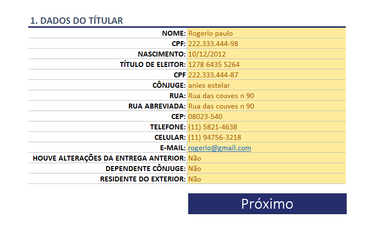
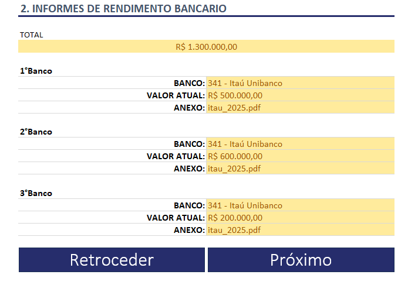

  

# 📄 Prime IR — Sistema de Declaração de Imposto de Renda em Excel

Projeto **acadêmico** desenvolvido em **Microsoft Excel**, com foco na
**organização, estruturação e apoio ao preenchimento da Declaração de Imposto de Renda**.
O sistema centraliza dados do contribuinte, informes de rendimento e extratos bancários
em uma interface simples e intuitiva.

---

## 🎯 Objetivo
Auxiliar no controle e consolidação das informações necessárias para a declaração
do Imposto de Renda, reduzindo erros de preenchimento e facilitando a visualização
dos dados financeiros.

---

## 🧠 Visão Geral do Sistema
O **Prime IR** foi projetado para simular um fluxo lógico de coleta de dados,
semelhante ao processo real de declaração, permitindo ao usuário navegar entre
as telas e preencher as informações de forma organizada.

---

## 🧩 Funcionalidades
- Cadastro completo dos **dados do titular**
- Registro de **informes de rendimento bancário**
- Controle de **extratos bancários e holerites**
- Organização de entradas por **data, categoria e valor**
- Navegação entre telas por meio de **botões interativos**
- Interface padronizada e orientada ao usuário

---

## ▶️ Como utilizar
1. Faça o download do arquivo Excel do projeto
2. Abra o arquivo no Microsoft Excel
3. Preencha os campos indicados nas telas
4. Utilize os botões para navegar entre as seções
5. Use as informações organizadas como apoio à declaração do IR

---

## 📷 Telas do Sistema

### 🧑 Dados do Titular
Tela destinada ao preenchimento das informações pessoais do contribuinte.

---

### 🏦 Informes de Rendimento Bancário
Área para registro dos valores informados pelas instituições financeiras.

---

### 📊 Extrato Bancário / Informe de Rendimentos
Tela para controle detalhado de entradas financeiras, como holerites e outros rendimentos.

---

### 📁 Menu de Navegação

Menu lateral que permite acesso rápido às principais seções do sistema.

---

## 🛠️ Tecnologias Utilizadas
- Microsoft Excel
- Fórmulas nativas
- Tabelas estruturadas
- Validação de dados
- Botões de navegação

---

## 📌 Requisitos
- Microsoft Excel  
- Recomenda-se Excel 2016 ou superior

---

## 👨‍🎓 Autor
**Augusto Belussi**
[GitHub](https://github.com/Augusto-BelussiB) | [LinkedIn](https://www.linkedin.com/in/augustobelussi) | [Instagram](https://www.instagram.com/augusto_belussi)

Projeto desenvolvido para fins **acadêmicos e de portfólio**.

---

## ⚠️ Aviso Legal
Este sistema não substitui os programas oficiais da Receita Federal.
Seu uso é destinado exclusivamente ao **apoio e organização de informações**.
